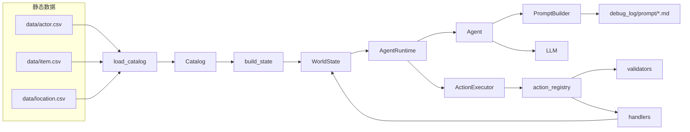
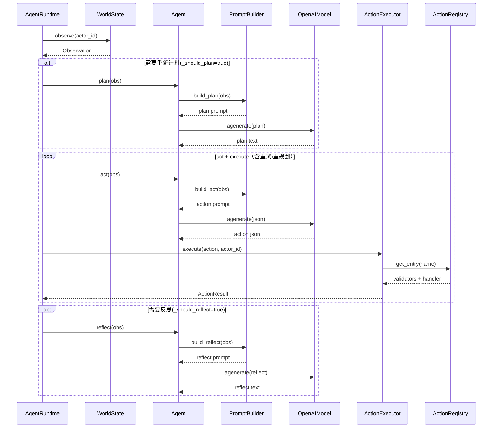
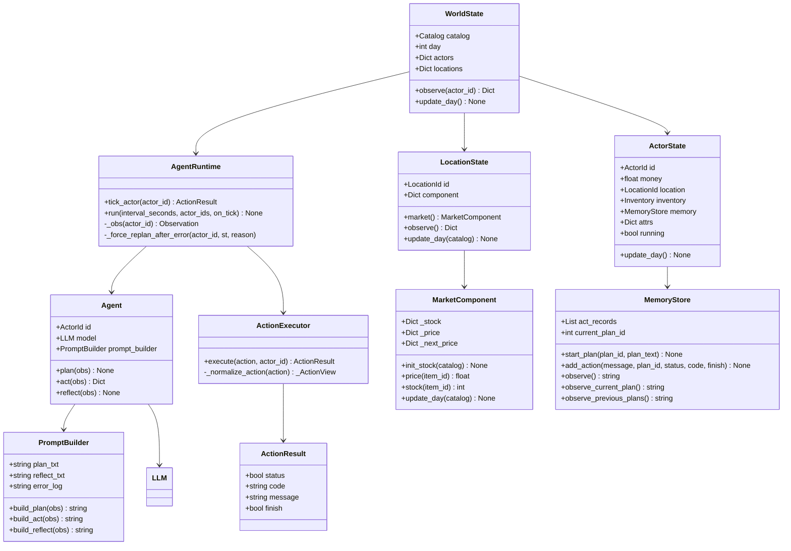
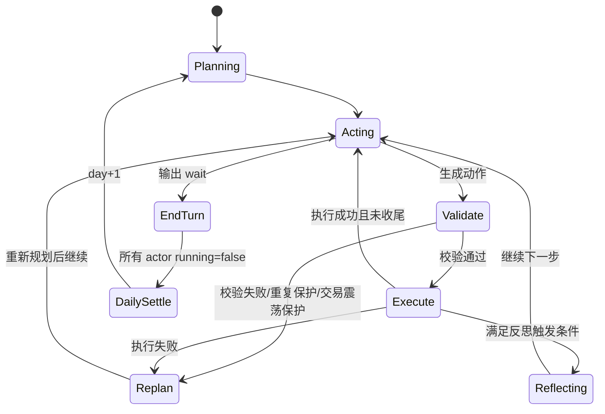
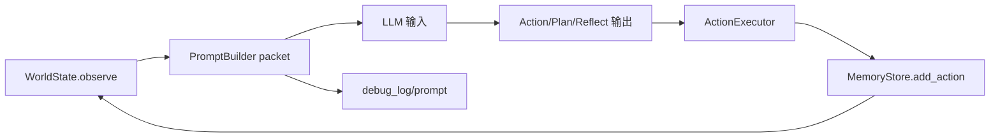

# AITown Decision Layer（图表导向说明）

> 这份 README 只提供快速上手视角，重点是帮助外部读者看懂代码主流程与模块关系。

## 1) 系统总览（模块与数据流）

## 2) Agent 决策时序图（单个 Actor 的一次 tick）

## 4) 核心类图（精简版）

## 5) 交易回合状态图（行为约束视角）

## 6) 建议在后续补充的图（可选）

如果你希望，我可以下一步把这份图表 README 再拆成两层：
1. 面向阅读者（超短版）
2. 面向开发者（含“改动作/改提示词/改市场”的定位导航）
