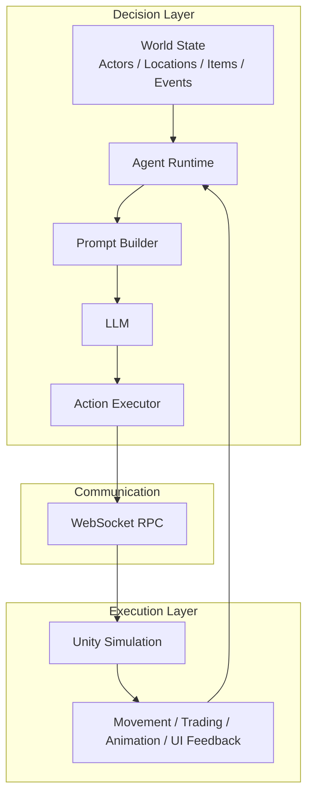
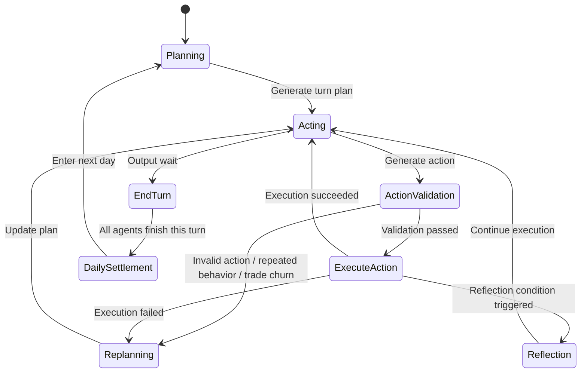

# AITown: A Multi-Agent Survival & Trading Simulation

## Project Background

AITown is an LLM-driven multi-agent economic simulation game.  
My goal was to push LLMs beyond "being able to chat" toward "making decisions, taking actions, and bearing consequences inside a continuously running world." To do that, I built a visualized small-town simulation where multiple agents form a complete behavioral loop: each character plans based on its own attributes, memory, location, money, items, and environmental events, then executes those actions in the game world and adjusts future behavior according to the result.

The system uses a two-layer architecture. `DecisionLayer` is responsible for reasoning, using Python to organize world state, prompt construction, memory management, action validation, execution scheduling, and reflection. `ExecutionLayer` is responsible for execution, using Unity to provide scene presentation, character movement, interaction animation, and frontend feedback. The two layers communicate over WebSocket, forming a runtime loop of "observe the world -> generate a plan -> execute actions -> receive feedback -> replan."

I did not want this project to be just another model API demo. What I wanted to validate was something closer to a real agent-system engineering approach: agents should be able to run over long horizons, and their behavior should be genuinely constrained by world rules. To support that, the system includes:
- data-driven world modeling
- turn-based state progression
- a market trading system
- random events
- action legality checks
- repeated-behavior guards
- failure-triggered replanning
- memory recording and reflection mechanisms

The result is both an AI town simulation prototype and a full "LLM + multi-agent" game system.

<p align="center">
  
</p>

## Core Gameplay

You are invited into a mysterious game and brought to a remote small town. There is no detailed tutorial. There is only one core rule:

> Survive first, then accumulate `10000` as fast as possible.

The first character to reach that goal wins.

Each in-game day is an independent turn. You need to move between locations, observe price changes, buy, sell, or consume items, and decide when to rest and when to keep acting. Actions are not free: the character continuously consumes satiety, hydration, and mental stamina. If any one of them reaches zero, the game is over immediately.

So making money is not the only objective. The real gameplay lies in balancing survival and profit. You need to exploit market fluctuations for gain, while avoiding greed, misjudgment, or over-action that can drag you into a dangerous state. Random events continuously disrupt the rhythm, making every round of decision-making uncertain.

## System Architecture

AITown uses a two-layer architecture: the upper layer thinks, and the lower layer executes. `DecisionLayer` maintains the global world state of the town and drives each agent through planning, acting, validation, memory, and reflection. `ExecutionLayer` maps those abstract actions into movement, interactions, and visual feedback inside Unity.



`DecisionLayer` can be understood as four core parts:
- `World State`: maintains character attributes, inventory, money, locations, market inventory, and random events
- `Agent Runtime`: drives multiple agents turn by turn and organizes the `plan -> act -> execute -> reflect` loop
- `Prompt Builder + LLM`: transforms the current observation into actionable decision input and generates plans and actions
- `Action Executor`: normalizes actions, validates legality, handles failures, and commits state changes

`ExecutionLayer` focuses on turning abstract actions into concrete in-scene behavior:
- receives movement, buy, sell, consume, and rest commands from the decision layer
- performs pathing, interaction animation, and HUD feedback inside Unity
- returns success or failure back to the decision layer for the next round of reasoning

A full runtime cycle looks like this:



## Technical Implementation

This project does not rely on an agent framework or a backend framework. Instead, it is implemented directly with `asyncio`, `websockets`, the OpenAI API, and Unity. The point was not to "use fewer tools," but to precisely control world state, action boundaries, execution feedback, and failure recovery.

The implementation can be summarized in six key points:
- **Python coroutine runtime**: each agent runs in its own async loop, driven by a unified runtime through `plan -> act -> execute -> reflect`
- **WebSocket RPC**: the decision layer treats Unity as a remote action execution endpoint and waits for action completion using `action_id + Future`
- **Action-space registry**: actions are defined as `handler + validators`, then registered, validated, and executed instead of being hard-coded into `if/else`
- **OpenAI JSON hard constraint**: the `act` stage uses OpenAI JSON mode so structured output is constrained at sampling time rather than repaired afterward
- **Prompt Builder**: turns world state, market information, memory, and action boundaries into structured context for `plan / act / reflect`
- **Behavior guard mechanisms**: repeated-action guard, trade-churn guard, split-action guard, and survival-priority guard

Two of the most important design choices are:

1. `Action Registry` is not just "a place to register functions." Each action is split into three layers: entrypoint, validator chain, and executor. After the model proposes an action, the system first resolves the name, normalizes parameters, and runs validators in sequence. Only if all checks pass is the action allowed to enter world-state mutation.
2. `OpenAI JSON mode` is fundamentally different from the common "please output JSON + retry if parsing fails" approach seen in many frameworks. The former constrains the model during sampling so it can only continue along token paths that remain valid JSON. The latter usually generates ordinary text first and only tries to parse or repair it afterward. In an agent system, that difference matters a lot, because once action output loses structural guarantees, the entire execution chain breaks.

For a more complete breakdown, see:
- [Technical Implementation Details](docs/technical-implementation-en.md)

## Economic System Design

The market is not a simple random fluctuation system. It is built on four interacting mechanisms: **mean reversion + log-space noise + inventory replenishment + trading friction**. Price updates are defined in log-price space:

$$
\log P_{t+1} = \log P_t + \kappa (\log P^{*} - \log P_t) + \varepsilon_t,\quad
\varepsilon_t \sim \mathcal{N}(0, \sigma^2)
$$

This design gives the market several important properties:
- prices always remain positive, and volatility is relative rather than absolute
- `KAPPA` pulls prices back toward intrinsic value and prevents long-run drift
- `SIGMA` determines risk intensity for different item categories
- `sellRatio` and daily replenishment together introduce trading friction and supply constraints, preventing the market from collapsing into trivial arbitrage

Under the current parameters, consumables behave like low-volatility, survival-oriented goods, while valuables behave like high-volatility, speculation-oriented assets. This naturally creates two distinct play styles: stable survival and high-risk speculation, without hard-coding those roles into the rules text.

For the full mathematical derivation and parameter rationale, see:
- [Economic System Details](docs/economy-system-en.md)

## How To Run

DecisionLayer:
```bash
cd DecisionLayer
pip install -r requirements.txt
python main.py
```

API setup:
- The decision layer depends on the OpenAI API, so you must set the `OPENAI_API_KEY` environment variable before running.
- Windows PowerShell:

```powershell
$env:OPENAI_API_KEY="your_api_key"
python main.py
```

- macOS / Linux:

```bash
export OPENAI_API_KEY="your_api_key"
python main.py
```

Dependency notes:
- `requirements.txt` is located at [`DecisionLayer/requirements.txt`](DecisionLayer/requirements.txt)
- Core dependencies include:
  - `openai`: model calls
  - `websockets`: communication with the Unity execution layer
  - `numpy`: world-state and market-related numerical computation
  - `PyQt5`: local monitor panel

Additional runtime details:
- Python `3.11+` is recommended
- `main.py` should be run with `DecisionLayer` as the working directory, otherwise relative data paths may fail
- If you want to run only the decision layer without connecting Unity, set `USE_ACTION_LAYER` to `False` in `DecisionLayer/config/config.py`
- If `PyQt5` is unavailable, the program automatically falls back to CLI mode

ExecutionLayer:
- Open Unity with `ExecutionLayer` as the project root for now; a standalone executable may be released later
- Make sure the WebSocket client address in the scene matches the decision layer. The default is `ws://127.0.0.1:9876`
- Start `DecisionLayer` first, then run the Unity scene and wait for the execution layer to connect

## Asset Credits

Some of the pixel tile assets used in the Unity scene come from the following packs:

1. Modern Exteriors - RPG Tileset [16x16]  
Author: LimeZu  
Source: https://limezu.itch.io/modernexteriors

2. Modern Interiors - RPG Tileset [16x16]  
Author: LimeZu  
Source: https://limezu.itch.io/moderninteriors

These assets are used in accordance with the creator's license terms.  
Due to asset licensing restrictions, the original asset files are not included in this repository and are only used for project demonstration.
