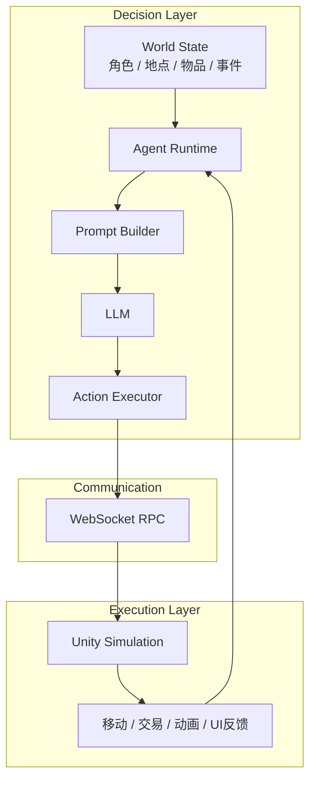
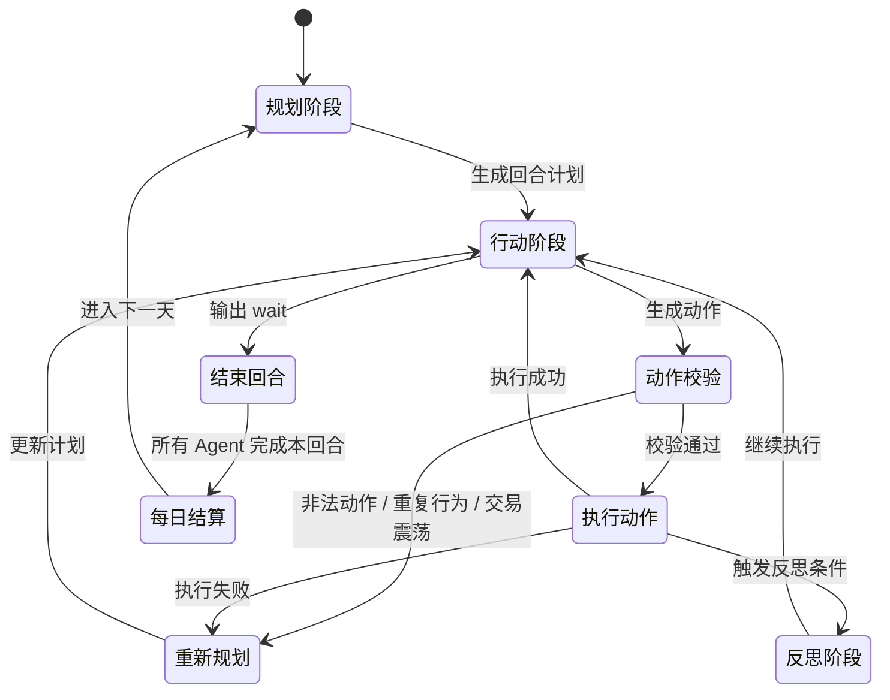

# 多Agent驱动的生存与贸易小镇模拟游戏

## 项目背景

AITown 是一个由 LLM 驱动的多智能体经济模拟游戏。
我希望把LLM从“能聊天”推进到“能在持续运行的世界里做决策、执行动作并承受结果”。
因此我用一个可视化的小镇模拟场景，搭建了一套多 Agent 的完整闭环：角色会基于自身属性、记忆、位置、金钱、物品和环境事件进行规划，再把动作落实到游戏世界中，并根据执行结果继续调整后续行为。

整个系统采用双层架构：`DecisionLayer` 负责决策，使用 Python 组织世界状态、Prompt 构建、记忆管理、动作校验、执行调度与反思总结；`ExecutionLayer` 负责执行，使用 Unity 承载场景表现、角色移动、交互动画和前端反馈。两层通过 WebSocket 通信，形成“观察世界 -> 生成计划 -> 执行动作 -> 接收回执 -> 重新规划”的运行链路。

我并不想只做一个调用模型API的 Demo，而是想验证一套更接近真实 Agent 系统的工程方案：一方面让智能体具备长期运行能力，另一方面让它的行为真正受到世界规则约束。为此，我在系统中加入了多种机制：
- 数据驱动的世界建模
- 回合制状态推进
- 市场交易系统
- 随机事件
- 动作合法性校验
- 重复行为保护
- 失败重规划
- 记忆记录和反思机制。
最终这个项目既是一个 AI 小镇模拟原型，也是一个“LLM + 多智能体”游戏系统。

## 核心玩法

你受邀参加一场神秘游戏，被带到一座偏僻的小镇。这里没有明确的新手引导，只有一条最核心的规则：
> 在保证生存的前提下，尽可能快地把资金积累到 `10000`。

率先达成目标的角色获胜。
小镇中的每一天都是一个独立回合。你需要在不同地点之间移动，观察物价变化，购买、出售或使用物品，并决定何时休息、何时继续行动。行动并不是没有代价的，角色会持续消耗饱食度、水分值和精神值；一旦其中任意一项归零，游戏立即失败。

因此，赚钱并不是唯一目标，真正的玩法是在“生存”和“收益”之间做取舍。你既要利用市场价格波动寻找利润，也要避免因为贪心、误判或过度行动把自己拖入危险状态。随机事件也会不断打乱原有节奏，让每一轮决策都带有不确定性。

## 系统架构

AITown 采用双层架构：上层负责思考，下层负责执行。`DecisionLayer` 维护整个小镇的世界状态，并驱动每个 Agent 完成规划、行动、校验、记忆和反思；`ExecutionLayer` 则把这些动作映射到 Unity 场景中的移动、交互和可视化反馈。



其中，`DecisionLayer` 可以进一步理解为 4 个核心部分：
- `World State`：维护角色属性、背包、金钱、地点、市场库存、随机事件等全局状态。
- `Agent Runtime`：驱动多 Agent 按回合运行，组织 plan -> act -> execute -> reflect 的主循环。
- `Prompt Builder + LLM`：把当前观察结果整理成可执行决策输入，并生成下一步计划与动作。
- `Action Executor`：负责动作归一化、合法性校验、失败处理和状态落地。

`ExecutionLayer` 则专注于把抽象动作变成具体表现：
- 接收来自决策层的移动、购买、出售、使用、休息等指令。
- 在 Unity 场景中完成角色寻路、交互动画和 HUD 展示。
- 将执行成功或失败的结果回传给决策层，进入下一轮决策。

一次完整的运行流程如下：



## 技术实现

这个项目刻意没有引入游戏 AI 框架、Agent 框架或后端 Web 框架，而是直接基于 Python 标准库、`asyncio`、`websockets`、OpenAI API 和 Unity 自行搭建。这样做的原因很简单：这个项目的重点不是“把现成框架拼起来”，而是把多智能体系统真正拆开，明确控制状态流、动作边界、通信协议和失败恢复逻辑。对于一个强调运行闭环和可解释性的项目来说，自己实现核心骨架反而更清晰。

### 1. Python 协程驱动多 Agent 运行时

决策层的核心调度完全建立在 Python 协程之上。每个 Agent 都有独立的异步循环，由统一 runtime 调度运行，按固定 tick 持续执行 `plan -> act -> execute -> reflect`。

```python
tasks = [
    asyncio.create_task(
        self._run_actor_loop(actor_id, interval_seconds, on_tick=on_tick),
        name=f"actor-{actor_id}",
    )
    for actor_id in target_ids
]
await asyncio.gather(*tasks)
```

这样做有几个直接好处：
- 多个 Agent 可以并发推进，而不是串行阻塞。
- 模型调用、动作执行、WebSocket 等待回执都可以自然地挂起，不会卡住整个系统。
- 调度模型足够轻，没有线程同步那种额外复杂度，更适合这种高 IO、低 CPU 的仿真场景。

### 2. WebSocket RPC：把 Unity 执行层当成远端动作服务

`ExecutionLayer` 本质上被我设计成一个“动作执行端”，决策层并不直接操作 Unity 对象，而是通过 WebSocket 下发命令、等待回执。这不是严格意义上的 RPC 框架，但在行为上非常接近一个轻量级 RPC 系统。

每次发送动作时，服务端都会生成 `action_id`，把一个 `Future` 挂到 `pending` 表里，等 Unity 返回同一个 `action_id` 的 `complete` 消息后再恢复执行：

```python
action_id = str(uuid.uuid4())
fut = asyncio.get_running_loop().create_future()
self.pending[action_id] = fut
await ws.send(json.dumps(payload))
msg = await asyncio.wait_for(fut, timeout=20)
```

这套通信方式解决了 3 个核心问题：
- 决策层和执行层彻底解耦，Python 不需要依赖 Unity 运行时。
- 动作是“有请求、有回执”的，而不是单向 fire-and-forget。
- 每个动作都能天然挂上超时、失败、重试和日志追踪机制。

### 3. 动作空间注册表

项目没有把所有动作写成一串 `if/else`，而是做了一个动作注册表。每种动作都由 `handler + validators` 组成，通过装饰器注册到统一入口，再由执行器完成归一化和分发。

```python
@register("buy", validators=[must_be_at(), must_have_stock()])
async def handle_buy(ctx, act) -> ActionResult:
    ...
```

这种设计的价值在于：
- 动作空间是显式的，系统允许什么动作一眼就能看清。
- 校验逻辑和执行逻辑分离，便于扩展和复用。
- 后续要加新动作、新 validator、新 skill，不需要改 runtime 主循环。

这也是我比较看重的一点：LLM 可以生成动作，但动作真正能不能进入世界，最终是由一层确定性的系统规则来裁决，而不是完全交给模型自由发挥。

### 4. OpenAI API 与 JSON 硬约束

在这个项目里，LLM 不只是生成自然语言，还必须生成结构化动作。因此我把 `plan / act / reflect` 分成了三条不同调用链：
- `plan`：生成阶段性计划文本
- `act`：强制输出 JSON 动作
- `reflect`：生成简短反思文本

其中 `act` 这一步用了 JSON mode 做硬约束，而不是只靠 prompt 说“请输出 JSON”。对于不同模型，我分别兼容了 `Responses API` 和 `Chat Completions API`：

```python
if restrict == "json":
    kwargs["text"] = {"format": {"type": "json_object"}}
```

或：

```python
if restrict == "json":
    kwargs["response_format"] = {"type": "json_object"}
```

然后再统一做 `json.loads()` 反序列化，保证 runtime 拿到的就是结构化动作对象，而不是一段“看起来像 JSON”的文本。

这背后的思路是：
- prompt 负责表达策略与边界。
- API 层负责约束输出格式。
- 执行层负责二次校验动作合法性。

也就是说，动作可靠性不是靠单点保证，而是“提示词约束 + API 结构化输出 + 系统规则校验”三层共同完成的。

### 5. Prompt Builder：把世界状态翻译成可执行上下文

这个项目里 Prompt 不是简单字符串拼接，而是一个专门的构建层。`PromptBuilder` 会把角色状态、物品信息、地点信息、市场库存、历史计划、执行记录、随机事件和动作边界整理成多段结构化上下文，再分别生成 `plan / act / reflect` 三种 prompt。

这样做的目的不是让 prompt 看起来复杂，而是尽量把“可执行信息”和“边界条件”提前算清楚，例如：
- 当前是否在集市，是否允许 `buy/sell`
- 背包数量是否足够 `consume/sell`
- 市场库存是否足够 `buy`
- 当前精神值是否还适合继续行动
- 某个动作是否已经重复过多次，是否应该触发重规划

本质上，这一层做的是“把世界状态翻译成模型真正能稳定利用的决策上下文”。

### 6. 记忆、反思与重规划闭环

Agent 不是每一步都从零开始思考。系统里专门有 `MemoryStore` 记录当日计划和动作结果，runtime 会根据执行状态决定是否反思、是否重规划，而不是无脑重复调用模型。

这一层带来的效果是：
- Agent 能区分“当前计划内已执行动作”和“旧计划历史”。
- 动作失败后不会机械重试，而是把错误原因写回上下文，强制重新规划。
- 反思不是装饰性文本，而是下一轮计划的输入之一。

这也是这个项目区别于很多“模型接游戏”的 Demo 的地方：重点不只是让模型能动，而是让模型在失败后还能继续活下去。

### 7. 世界状态与规则系统

整个小镇不是硬编码脚本，而是“静态定义 + 动态状态”两层：
- 静态层用 CSV / JSON 描述角色、地点、物品和事件。
- 动态层用 `WorldState / ActorState / LocationState` 维护回合中实时变化的数据。

这让系统同时具备两个特性：
- 内容扩展比较简单，新增角色、地点、物品基本是数据驱动。
- 决策层始终面对的是统一状态接口，不需要关心底层数据来源。

### 8. 行为保护机制

为了避免 Agent 掉进“看起来合理、实际上在原地打转”的循环里，runtime 额外实现了几类保护逻辑：
- 重复动作保护：阻止连续输出完全相同的动作。
- 交易震荡保护：限制同一回合对同一物品来回买卖。
- 拆分动作保护：避免把同一类动作拆成很多个低效小步骤。
- 生存优先保护：在饥饿、口渴、疲劳危险时，允许打断原计划优先自救。

这些机制并不依赖模型“自己想明白”，而是由运行时主动兜底。对于长期运行的 Agent 系统来说，这种兜底机制往往比单次 prompt 优化更重要。

### 9. 为什么没有用框架

这个项目没有使用 LangChain、AutoGen、CrewAI、FastAPI 之类的框架，原因不是排斥框架，而是这个项目本身更适合“自己把系统骨架写清楚”：
- Agent 的核心循环高度定制，现成框架通常会引入额外抽象层，反而不利于精确控制。
- 这个项目需要把“世界状态、动作校验、执行回执、失败恢复”放在同一个闭环里，通用框架未必贴合。
- 作为作品集项目，我更希望展示底层设计能力，而不是框架使用熟练度。

换句话说，这个项目的技术重点不是“我会调一个 Agent 框架”，而是“我能从零把一个可运行的 Agent 系统搭起来，并把关键机制落到代码里”。

## 经济系统设计

这个项目的经济系统不是简单的“随机涨跌”，而是试图在 **可解释性、可玩性和可控性** 之间找到平衡。我的目标很明确：价格必须波动，但不能彻底失控；必须允许投机，但不能让最优策略退化成无脑套利；必须让不同品类表现出不同风险结构，而不是所有商品都只是数字大小不同。

### 1. 价格模型：均值回归 + 对数噪声

市场价格更新的核心公式写在 `MarketComponent.generate_price()` 里，本质上是一个定义在对数价格上的离散均值回归过程：

```python
lnP = lnP + kappa * (lnbase - lnP) + rng.normal(0.0, sigma, size=lnP.shape)
next_price = exp(lnP)
```

把它写成更标准的数学形式就是：

$$
\log P_{t+1} = \log P_t + \kappa (\log P^{*} - \log P_t) + \varepsilon_t
$$

$$
\varepsilon_t \sim \mathcal{N}(0, \sigma^2)
$$

其中：
- $P_t$ 是当前价格
- $P^{*}$ 是物品的基础价格 `base_price`
- $\kappa$（KAPPA）控制均值回归速度
- $\sigma$（SIGMA）控制波动强度

这个设计有两个非常关键的意义：
- 在 **对数空间** 中建模，意味着噪声是乘法噪声而不是加法噪声，价格天然保持为正，不会出现负价格。
- 加入 **均值回归** 后，价格会围绕基础价值上下波动，而不是像纯随机游走那样长期漂到失真区间。

如果只用高斯随机游走，长期运行后价格方差会不断扩散，最终市场会越来越不可控；而引入均值回归后，系统会持续把价格拉回“基本面”附近，形成一个更稳定的长期分布。

### 2. 为什么要在对数空间里加噪声

对数噪声比线性噪声更适合这个项目的原因有 3 个：
- 它更符合交易直觉。玩家感受到的往往不是“涨了 3 块钱”，而是“涨了 20%”。
- 它天然适配不同价格量级的商品。5 元的水和 1000 元的黄金，可以共享同一套相对波动逻辑。
- 它保证价格永远为正，数值稳定性更好。

换句话说，这套模型控制的不是“绝对价差”，而是“相对涨跌幅”。这对于一个同时包含低价生存品和高价投机品的小镇市场来说非常重要。

### 3. KAPPA：为什么取 0.11

当前配置中，两类商品的 `KAPPA` 都设为：

```python
KAPPA = {
    "comsumable": 0.11,
    "valuable": 0.11,
}
```

$\kappa = 0.11$ 的含义是：每天大约回收 11% 的“偏离基础价格的误差”。  
换成更直观的表达，若忽略噪声项，价格偏离会按 $(1 - \kappa)^t = 0.89^t$ 递减。

这意味着它的回归速度是一个比较温和的区间：
- 不会快到“今天涨、明天立刻归零”，否则投机窗口太短，市场没有观察价值。
- 也不会慢到价格长期漂在远离基本面的区域，否则商品会失去“基础价格”这个锚点。

如果用半衰期来理解，偏离量的半衰期大约是：

$$
t_{\frac{1}{2}} \approx \frac{\ln 0.5}{\ln 0.89} \approx 6 \text{ 天}
$$

也就是说，一次明显偏离大约要 6 个回合左右才会衰减一半。这个速度对回合制小镇模拟来说比较合适：足够让玩家感受到趋势，也足够让市场在中期内重新回到合理区间。

这里我让两类商品共享同一个 `KAPPA`，是因为我想把“品类差异”主要放在 **风险幅度** 上，而不是放在“回归速度”上。这样系统更容易理解：大家都围绕各自的基础价值回归，但不同商品的波动强弱不一样。

### 4. SIGMA：为什么消耗品和贵重品差这么多

当前配置中：

```python
SIGMA = {
    "comsumable": 0.15,
    "valuable": 0.4,
}
```

这里的差异其实是在刻意制造两种完全不同的市场性格。

#### 消耗品：`SIGMA = 0.15`

消耗品包括水、面包、肉等生存资源。它们承担的是“保底”和“日常补给”功能，因此价格不能太疯。

$\sigma = 0.15$ 对应的单日对数噪声标准差大约意味着：

$$
e^{0.15} \approx 1.16
$$

也就是单日典型波动大致在 `±16%` 这个量级。  
这足以让玩家感受到“今天肉有点贵”“今天水比较便宜”，但不会让食物价格夸张到直接摧毁生存平衡。

#### 贵重品：`SIGMA = 0.4`

贵重品例如银戒指、黄金，承担的是“投机”和“财富储存”功能，因此必须显著更不稳定。

$\sigma = 0.4$ 对应：

$$
e^{0.4} \approx 1.49
$$

这意味着单日典型波动接近 `±50%` 的量级，已经是一个非常明显的风险资产特征。  
这样设计的结果是：
- 低风险玩家可以依赖消耗品和稳健交易慢慢积累。
- 高风险玩家可以围绕贵重品博取更高收益，但也必须承受更大回撤。

也就是说，`SIGMA` 的区别实际上定义了这个市场里的 **风险分层**。

### 5. 长期分布：为什么市场不会炸掉

这个模型真正稳定的原因，不在于“随机数比较小”，而在于它本身就是一个有稳态的过程。

在离散均值回归模型下，对数价格围绕 $\log P^{*}$ 的平稳方差近似为：

$$
\mathrm{Var}(\log P) \approx \frac{\sigma^2}{1 - (1 - \kappa)^2}
$$

在 $\kappa = 0.11$ 时，分母约为：

$$
1 - 0.89^2 = 0.2079
$$

于是可以得到一个很直观的结论：
- 消耗品：`σ = 0.15`，长期波动相对温和。
- 贵重品：`σ = 0.4`，长期波动显著更大，但仍然被均值回归项束缚在有限范围内。

这就是我想要的市场形态：**有波动、有机会、有风险，但不会随着回合数增加而彻底失真。**

### 6. 库存系统：价格之外的第二层约束

价格系统并不是单独运行的，市场还有一层库存约束：

```python
self._stock[item_id] = min(default_quantity, current_stock + DEFAULT_MARKET_STOCK_INCREASE)
```

当前设置里：
- 默认库存 `DEFAULT_MARKET_STOCK = 40`
- 每日补货 `DEFAULT_MARKET_STOCK_INCREASE = 10`

库存系统的作用不是精确模拟供应链，而是提供一个足够简单但有效的供给恢复机制：
- 玩家连续扫货会暂时压缩可交易空间。
- 市场不会因为一次交易就永久枯竭。
- 补货速度慢于“一次性补满”，所以短期行为仍然会留下痕迹。

这让市场同时具有“可扰动”和“可恢复”两个特征。

### 7. 买卖价差：防止最优策略退化为无脑搬砖

如果只有价格波动而没有交易摩擦，最优策略很容易退化成机械套利。因此我在 `item.csv` 里给不同商品设定了 `sellRatio`：

- 生存品通常低于 `1`，例如水和面包是 `0.85`，肉是 `0.8`
- 贵重品接近或等于 `1`

这意味着：
- 消耗品更像“使用型商品”，买来主要是为了生存，不适合高频倒手。
- 贵重品更像“投机型商品”，更适合围绕价格波动做持有和换手。

换句话说，`sellRatio` 是这个经济系统里非常重要的一层“交易摩擦”。它和 `SIGMA` 一起决定了某类商品到底更像 **消费品** 还是 **资产**。

### 8. 为什么这样分层是合理的

从玩法设计上看，这套市场其实对应了两条不同的生存路径：

- **低风险路径**：围绕消耗品做补给管理，优先保证饱食度、水分值和精神值安全，赚得慢但稳定。
- **高风险路径**：围绕贵重品做波段交易，收益空间更大，但一旦踩错节奏，资金回撤也会更明显。

这种分层并不是写在规则文本里的，而是直接由价格模型参数推出来的。  
也就是说，玩家不需要先读设计文档，只要开始交易，就会逐渐感受到“哪些物品适合活命，哪些物品适合冒险”。

### 9. 为什么我认为这套设计是有效的

我比较满意这套经济系统的地方，不是它有多复杂，而是它用很少的参数表达了足够清晰的市场行为：

- `base_price` 提供基本面锚点
- `KAPPA` 控制回归速度
- `SIGMA` 控制风险强度
- `sellRatio` 提供交易摩擦
- `stock + restock` 提供供给约束

这 5 个量组合起来，已经足以形成一个可解释、可调参、可长期运行的微型经济系统。  
从工程角度看，它也非常适合作品集展示，因为它不是“把随机数塞进价格”，而是带有明确建模意图和参数语义的一套小型市场模型。

## 运行方法：
DecisionLayer:
```bash
cd DecisionLayer
pip install -r requirements.txt
python main.py
```

API 配置：
- 本项目的决策层依赖 OpenAI API，运行前需要配置环境变量 `OPENAI_API_KEY`
- Windows PowerShell:

```powershell
$env:OPENAI_API_KEY="your_api_key"
python main.py
```

- macOS / Linux:

```bash
export OPENAI_API_KEY="your_api_key"
python main.py
```

依赖说明：
- `requirements.txt` 位于 [`DecisionLayer/requirements.txt`](/f:/Project/Unity/AITown/DecisionLayer/requirements.txt)
- 核心依赖包括：
  - `openai`：模型调用
  - `websockets`：与 Unity 执行层通信
  - `numpy`：世界状态与市场数值计算
  - `PyQt5`：本地监控面板
  - `matplotlib`：数值测试脚本使用

运行细节补充：
- 建议使用 `Python 3.11+`
- `main.py` 需要以 `DecisionLayer` 作为工作目录运行，否则相对路径数据文件可能找不到
- 如果只想单独运行决策层而不连接 Unity，可以将 `DecisionLayer/config/config.py` 中的 `USE_ACION_LAYER` 改为 `False`
- 当 `PyQt5` 不可用时，程序会自动退回到 CLI 模式运行

ExcExecutionLayer:
- 以ExcutionLayer作为根目录在unity打开(暂时,后续会发布为可执行文件)
- 打开后确保场景中的 WebSocket 客户端地址与决策层一致，默认是 `ws://127.0.0.1:9876`
- 先启动 `DecisionLayer`，再运行 Unity 场景，等待执行层完成连接


## 素材来源

本项目 Unity 场景中的部分像素瓦片素材来自以下素材包：

1. Modern Exteriors - RPG Tileset [16x16]  
作者：LimeZu  
素材地址：https://limezu.itch.io/modernexteriors

2. Modern Interiors - RPG Tileset [16x16]
作者：LimeZu
素材地址：https://limezu.itch.io/moderninteriors

上述素材依据作者提供的许可协议使用。  
由于素材授权限制，本仓库不包含原始素材文件，仅用于项目演示。
