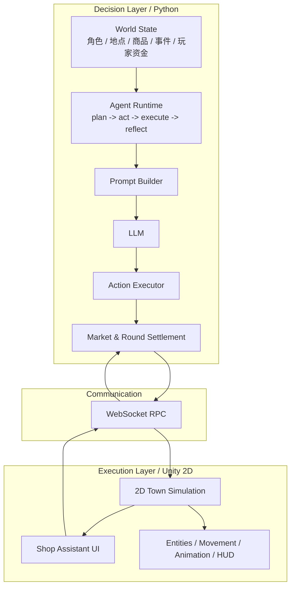
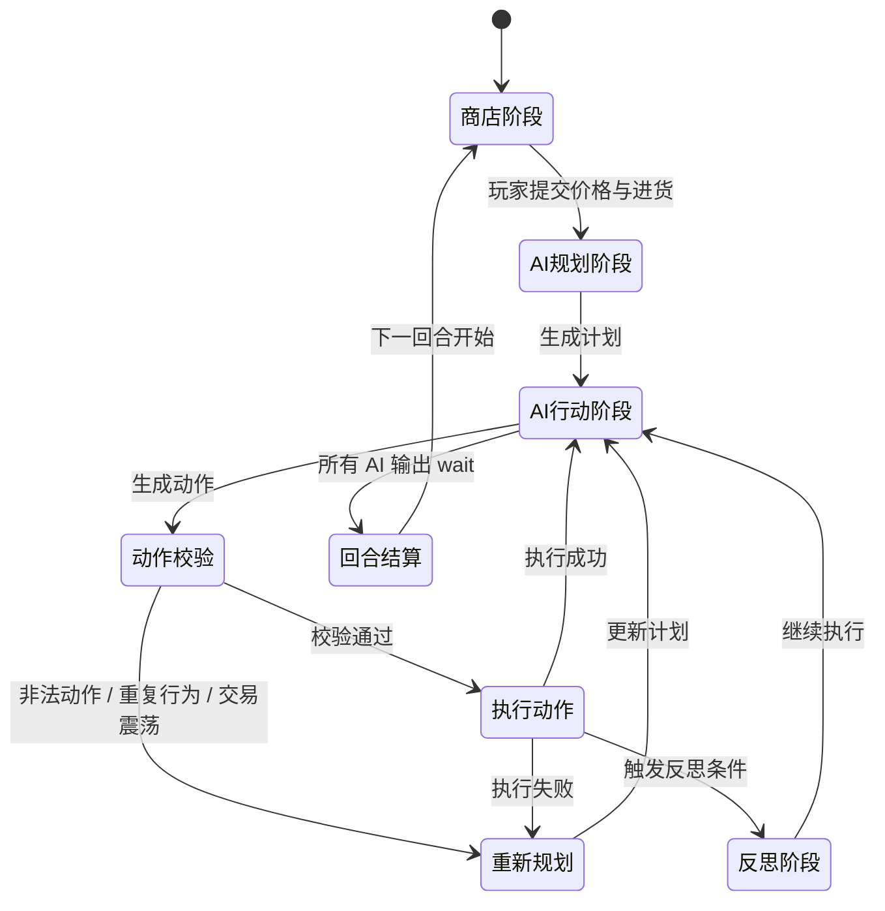

# GreedTown: Agent 驱动的 2D 商店经营与生存博弈

**一个由 LLM Agent 驱动、由人类玩家经营商店的 Unity 2D 小镇模拟游戏。**

## 项目背景

GreedTown 最初是一个多 Agent 生存与交易模拟：四个 AI 角色在小镇中移动、观察市场、买卖物品并努力存活，率先积累到目标资金的角色获胜。随着玩法迭代，项目的重心已经从“观察 AI 之间的市场竞争”转向“人类玩家与 AI Agent 之间的经营博弈”。

当前版本中，人类玩家扮演商店店主，AI Agent 仍然是小镇中的自主行动者。玩家可以调整商品价格、决定进货数量、管理商店现金流，并通过市场供给影响 AI 的生存与收益。玩家的目标不是简单地赚得越多越好，而是在维持 AI 不死亡的同时，阻止任何 AI 过早达到胜利资金。玩家自己赚取到目标金额则胜利，资金破产则失败。

这个设计让项目保留了原本的 Agent 主线：AI 仍然会基于状态、记忆、市场、库存、价格和事件进行决策；同时加入了一个可被人类操控的经济节点，使玩家不再只是旁观者，而是市场规则的一部分。AI 还可以通过决策点机制对玩家的操作形成限制，例如影响下一日价格、锁定商品价格或获得市场情报，从而把经营玩法变成双向博弈。

系统仍采用双层架构：

- `DecisionLayer`：Python 后端，负责世界状态、Agent 决策、回合推进、市场结算、动作校验、记忆与反思。
- `ExecutionLayer`：Unity 2D 前端，负责场景实体、角色移动、商店交互、大量 UI 展示、回合动画与玩家操作。

两层通过 WebSocket 通信，形成“后端生成世界与 Agent 决策，Unity 展示并收集玩家经营操作，再回传后端结算”的闭环。

<p align="center">
  
</p>

## 核心玩法

你经营小镇中唯一的商店。四个 AI Agent 会在小镇中自主生存、消费、交易、投机并尝试积累资金。你的任务是在每一回合中调整商店策略，让自己赚到足够的钱，同时维持整个小镇的微妙平衡。

核心目标：

> 玩家赚取到 `10000` 资金则胜利；玩家破产则失败；任一 AI 死亡或任一 AI 先达到 `10000` 都意味着玩家没有维持住目标平衡，玩家失败。

玩家每回合需要关注几类决策：

- **定价**：调整商品当日售价，决定利润空间与 AI 的购买压力。
- **进货**：根据现金和市场需求补充库存，避免缺货导致 AI 无法维持生存。
- **现金流**：进货会消耗玩家资金，销售才能回收资金，过度进货可能导致破产。
- **AI 状态**：AI 有饱食度、水分值、精神值和资金压力，任一关键生存属性归零都会导致失败。
- **AI 胜利压力**：AI 会通过交易、套利和策略积累资金，玩家需要控制市场节奏，不能让 AI 先达成目标。

因此，AITown 当前的核心体验不是单纯的经营模拟，也不是单纯的 AI 自动对战，而是一个不对称博弈：玩家掌握商店供给与价格，AI 掌握行动选择、市场判断和决策点干预能力。

## AI 决策点机制

为了避免玩家完全支配市场，AI 拥有决策点机制。AI 可以在回合推进中消耗决策资源，对市场或自身判断产生额外影响，例如：

- 限制玩家对特定商品的价格调整，使价格在下一日被锁定。
- 获取或影响下一日价格情报，让自己的交易计划更接近真实市场变化。
- 通过决策结果改变后续行动策略，使玩家无法只依赖固定定价套路。

这些机制让 AI 不只是被动消费者，而是能够反制玩家经营策略的 Agent。玩家需要在利润、库存、生存供给和 AI 反制之间持续权衡。

## 系统架构

AITown 采用 `DecisionLayer + ExecutionLayer` 的双层结构。后端负责规则和推理，前端负责可视化和玩家输入。



`DecisionLayer` 当前负责：

- 维护全局世界状态：AI 属性、位置、资金、背包、商品目录、市场库存、玩家资金和随机事件。
- 驱动多 Agent 回合循环：`plan -> act -> execute -> reflect`。
- 校验并执行动作：移动、购买、出售、使用、休息、等待等。
- 处理商店阶段：推送市场信息到 Unity，等待玩家提交价格与库存调整，再写回后端状态。
- 处理回合结算：价格推进、库存变化、玩家收益、AI 生存消耗、随机事件和胜负判断。
- 处理 AI 决策点：记录决策结果、锁价、情报、现金变化和私有上下文。

`ExecutionLayer` 当前负责：

- 展示 Unity 2D 小镇、商店、角色实体和交互动画。
- 接收后端动作指令并执行角色移动、交易反馈、状态弹窗等表现。
- 提供商店店主 UI：商品列表、价格、库存、进货、资金、回合开始/结束提示。
- 将玩家的价格和进货计划通过 WebSocket 回传给后端。
- 展示市场、玩家收益、AI 状态和回合变化等前端反馈。

## 回合流程

当前版本的回合不再只是 AI 自动推进，而是加入了玩家商店阶段：



在回合结算时，后端会处理：

- 玩家当日收入与资金变化。
- 市场价格推进和下一日价格生成。
- AI 生存属性消耗与每日恢复/事件效果。
- AI 决策点产生的锁价或情报影响。
- 随机事件触发与持续时间更新。

## 市场与经营系统

市场系统已经从原先偏 AI 自循环的价格波动模型，扩展为玩家可干预的商店经营模型。

商品仍然有基础价格、分类、出售比例、默认库存和随机波动参数。价格生成使用均值回归和对数噪声：

$$
\log P_{t+1} = \log P_t + \kappa(\log P^{*} - \log P_t) + \varepsilon_t,\quad
\varepsilon_t \sim \mathcal{N}(0, \sigma^2)
$$

但当前市场还加入了玩家操作与 AI 干预：

- 玩家可以在 Unity 商店 UI 中修改当日价格。
- 玩家可以决定每种商品的进货数量，进货会消耗玩家现金。
- 后端会同步玩家提交后的 `currentMoney`、`currentStock` 和 `todayPrice`。
- 被 AI 决策点锁定的商品价格不会被玩家当日修改覆盖。
- AI 的市场情报可以影响下一日价格预期，让 AI 对玩家策略形成反制。

这使得价格不再只是随机过程，而是“系统波动 + 玩家经营 + AI 决策点”的组合结果。

## 技术实现

项目没有依赖完整的 Agent 框架或后端 Web 框架，而是直接基于 Python、Unity 和 WebSocket 构建运行时。

核心实现包括：

- **Python 异步 Runtime**：多 Agent 以协程方式运行，由统一 runtime 调度计划、行动、执行和反思。
- **WebSocket RPC**：后端把 Unity 视作远程执行层，通过 action id 等待动作回执，也通过消息同步市场和玩家操作。
- **Action Registry**：动作由 handler 和 validator 组成，先注册、再校验、再执行，减少硬编码分支。
- **结构化 LLM 输出**：`act` 阶段使用结构化 JSON 输出，降低动作解析失败对执行链的影响。
- **商店阶段同步**：后端在回合开始向 Unity 推送市场信息，等待玩家提交库存和价格，再继续推进 AI 行动。
- **回合结算重构**：价格推进、玩家收入、库存更新、AI 生存消耗、随机事件和决策点效果集中在日结算流程中处理。
- **Unity UI 扩展**：前端新增商店店主界面、商品库存界面、回合开始/结束提示、资金显示、状态弹窗和商品图标映射。

更完整的旧版技术说明见：

- [技术实现详解](docs/technical-implementation.md)
- [经济系统设计详解](docs/economy-system.md)

> 注意：上述文档可能仍包含旧玩法说明，当前 README 以新玩法为准。

## 项目结构

```text
AITown/
├── DecisionLayer/          # Python 决策层与回合结算逻辑
│   ├── actions/            # 动作注册、校验、执行
│   ├── config/             # 模型、市场、胜负和运行配置
│   ├── data/               # 角色、地点、商品、事件数据
│   ├── model/              # 世界状态、定义、Agent Brain、WebSocket
│   ├── runtime/            # 运行时加载与调度
│   └── main.py             # 后端入口
├── ExecutionLayer/         # Unity 2D 执行层
│   ├── Assets/             # 场景、脚本、UI、资源
│   ├── Packages/
│   └── ProjectSettings/
├── docs/                   # 旧版技术与经济系统说明
├── README.md
└── README-EN.md
```

## 运行方式

### DecisionLayer

```bash
cd DecisionLayer
pip install -r requirements.txt
python main.py
```

运行前需要配置 OpenAI API Key。

Windows PowerShell:

```powershell
$env:OPENAI_API_KEY="your_api_key"
python main.py
```

macOS / Linux:

```bash
export OPENAI_API_KEY="your_api_key"
python main.py
```

补充说明：

- 建议使用 Python `3.11+`。
- `main.py` 建议以 `DecisionLayer` 作为工作目录运行，否则相对路径数据文件可能无法找到。
- 核心依赖见 [`DecisionLayer/requirements.txt`](DecisionLayer/requirements.txt)。
- 后端默认需要连接 Unity 执行层；如需仅运行决策层，可在配置中关闭动作层连接。

### ExecutionLayer

1. 使用 Unity 打开 `ExecutionLayer` 目录。
2. 确保场景中的 WebSocket 客户端地址与后端一致，默认地址为 `ws://127.0.0.1:9876`。
3. 先启动 `DecisionLayer`，再运行 Unity 场景。
4. 等待 Unity 连接后，商店阶段会在回合开始时显示玩家操作 UI。

## 当前版本重点变化

- 玩法从“AI 之间的生存交易竞赛”改为“人类店主经营商店，对抗并维持 AI Agent 生态”。
- Unity 端新增商店店主实体、商品经营界面、库存/进货 UI、回合提示和大量状态反馈。
- 后端回合结算重构，支持玩家商店阶段、玩家资金同步、库存更新和价格提交。
- 市场逻辑从纯系统波动扩展为玩家定价、玩家进货、AI 决策点和价格情报共同作用。
- AI 新增决策点相关上下文，可限制或影响玩家的市场操作。

## 素材来源

本项目 Unity 场景中的部分像素瓦片素材来自以下素材包：

1. Modern Exteriors - RPG Tileset [16x16]  
   作者：LimeZu  
   地址：https://limezu.itch.io/modernexteriors

2. Modern Interiors - RPG Tileset [16x16]  
   作者：LimeZu  
   地址：https://limezu.itch.io/moderninteriors

上述素材依据作者提供的许可协议使用。由于素材授权限制，本仓库不包含原始素材文件，仅用于项目演示。
