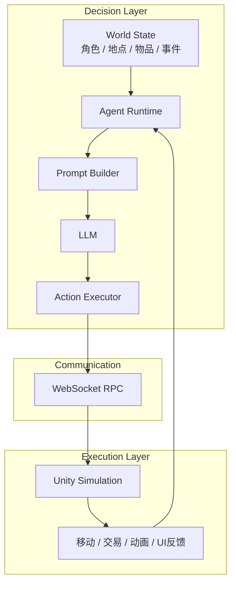
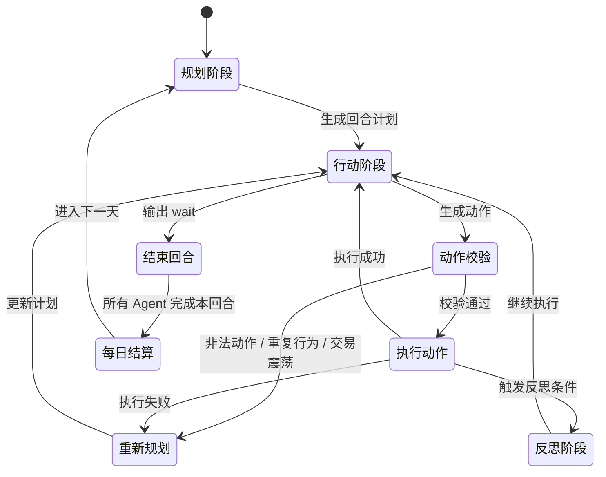

# AITown: A Multi-Agent Survival & Trading Simulations
**多Agent驱动的生存与贸易小镇模拟游戏**

## 项目背景

AITown 是一个由 LLM 驱动的多智能体经济模拟游戏。
我希望把LLM从“能聊天”推进到“能在持续运行的世界里做决策、执行动作并承受结果”。
因此我用一个可视化的小镇模拟场景，搭建了一套多 Agent 的完整闭环：角色会基于自身属性、记忆、位置、金钱、物品和环境事件进行规划，再把动作落实到游戏世界中，并根据执行结果继续调整后续行为。

整个系统采用双层架构：`DecisionLayer` 负责决策，使用 Python 组织世界状态、Prompt 构建、记忆管理、动作校验、执行调度与反思总结；`ExecutionLayer` 负责执行，使用 Unity 承载场景表现、角色移动、交互动画和前端反馈。两层通过 WebSocket 通信，形成“观察世界 -> 生成计划 -> 执行动作 -> 接收回执 -> 重新规划”的运行链路。

我并不想只做一个调用模型API的 Demo，而是想验证一套更接近真实 Agent 系统的工程方案：一方面让智能体具备长期运行能力，另一方面让它的行为真正受到世界规则约束。为此，我在系统中加入了多种机制：
- 数据驱动的世界建模
- 回合制状态推进
- 市场交易系统
- 随机事件
- 动作合法性校验
- 重复行为保护
- 失败重规划
- 记忆记录和反思机制。
最终这个项目既是一个 AI 小镇模拟原型，也是一个“LLM + 多智能体”游戏系统。

<p align="center">
  
</p>

## 核心玩法

你受邀参加一场神秘游戏，被带到一座偏僻的小镇。这里没有明确的新手引导，只有一条最核心的规则：
> 在保证生存的前提下，尽可能快地把资金积累到 `10000`。

率先达成目标的角色获胜。
小镇中的每一天都是一个独立回合。你需要在不同地点之间移动，观察物价变化，购买、出售或使用物品，并决定何时休息、何时继续行动。行动并不是没有代价的，角色会持续消耗饱食度、水分值和精神值；一旦其中任意一项归零，游戏立即失败。

因此，赚钱并不是唯一目标，真正的玩法是在“生存”和“收益”之间做取舍。你既要利用市场价格波动寻找利润，也要避免因为贪心、误判或过度行动把自己拖入危险状态。随机事件也会不断打乱原有节奏，让每一轮决策都带有不确定性。

## 系统架构

AITown 采用双层架构：上层负责思考，下层负责执行。`DecisionLayer` 维护整个小镇的世界状态，并驱动每个 Agent 完成规划、行动、校验、记忆和反思；`ExecutionLayer` 则把这些动作映射到 Unity 场景中的移动、交互和可视化反馈。



其中，`DecisionLayer` 可以进一步理解为 4 个核心部分：
- `World State`：维护角色属性、背包、金钱、地点、市场库存、随机事件等全局状态。
- `Agent Runtime`：驱动多 Agent 按回合运行，组织 plan -> act -> execute -> reflect 的主循环。
- `Prompt Builder + LLM`：把当前观察结果整理成可执行决策输入，并生成下一步计划与动作。
- `Action Executor`：负责动作归一化、合法性校验、失败处理和状态落地。

`ExecutionLayer` 则专注于把抽象动作变成具体表现：
- 接收来自决策层的移动、购买、出售、使用、休息等指令。
- 在 Unity 场景中完成角色寻路、交互动画和 HUD 展示。
- 将执行成功或失败的结果回传给决策层，进入下一轮决策。

一次完整的运行流程如下：



## 技术实现

这个项目没有引入 Agent 框架或后端框架，而是直接基于 `asyncio`、`websockets`、OpenAI API 和 Unity 自行实现。这样做的目的不是“少用工具”，而是为了精确控制世界状态、动作边界、执行回执和失败恢复逻辑。

核心实现可以概括为 6 点：
- **Python 协程 Runtime**：每个 Agent 运行在独立异步循环中，由统一 runtime 调度 `plan -> act -> execute -> reflect`。
- **WebSocket RPC**：决策层把 Unity 视为远端动作执行端，通过 `action_id + Future` 的方式等待动作回执。
- **动作空间注册表**：动作由 `handler + validators` 组成，先注册、再校验、再执行，而不是直接写死在 `if/else` 中。
- **OpenAI JSON 硬约束**：`act` 阶段使用 OpenAI API 的 JSON mode，让结构化输出约束发生在采样阶段，而不是事后修补文本。
- **Prompt Builder**：把世界状态、市场信息、记忆和动作边界整理成结构化上下文，分别服务于 `plan / act / reflect`。
- **行为保护机制**：包括重复动作保护、交易震荡保护、拆分动作保护和生存优先保护。

其中两个最关键的设计是：

1. `Action Registry` 并不只是“登记一个函数”，而是把每个动作拆成“入口 + 校验器链 + 执行器”三层。模型提出动作后，系统会先做名称解析、参数归一化和 validator 链式检查，全部通过后才允许进入世界状态更新。
2. `OpenAI JSON mode` 和很多框架常见的“请输出 JSON + 解析失败重试”不是一回事。前者是在采样阶段约束模型只能沿着合法 JSON 的 token 路径继续生成；后者通常是生成完普通文本后再尝试解析或修复。对 Agent 系统来说，这种差别非常关键，因为动作输出一旦失去结构化约束，整个执行链就会断掉。

更完整的实现说明见：
- [技术实现详解](docs/technical-implementation.md)

## 经济系统设计

市场并不是简单随机波动，而是围绕 **均值回归 + 对数噪声 + 库存恢复 + 交易摩擦** 四层机制构建的。价格更新公式定义在对数价格空间中：

$$
\log P_{t+1} = \log P_t + \kappa (\log P^{*} - \log P_t) + \varepsilon_t,\quad
\varepsilon_t \sim \mathcal{N}(0, \sigma^2)
$$

这套设计带来了几个非常重要的性质：
- 价格始终为正，且波动是相对比例意义上的，而不是绝对价差。
- `KAPPA` 负责把价格持续拉回基础价值，避免长期漂移失控。
- `SIGMA` 决定不同品类的风险强度，让消耗品和贵重品呈现不同市场性格。
- `sellRatio` 和每日补货机制共同提供交易摩擦与供给约束，防止策略退化成无脑套利。

当前参数下，消耗品是低波动、偏生存导向的商品；贵重品是高波动、偏投机导向的资产。这使得系统自然分化出“稳健生存”和“高风险投机”两条路径，而不是把这种差异写死在规则文本里。

更完整的数学推导和参数分析见：
- [经济系统设计详解](docs/economy-system.md)

## 运行方法

DecisionLayer:
```bash
cd DecisionLayer
pip install -r requirements.txt
python main.py
```

API 配置：
- 本项目的决策层依赖 OpenAI API，运行前需要配置环境变量 `OPENAI_API_KEY`,在config/config.py中指定三个阶段的模型名称
- Windows PowerShell:

```powershell
$env:OPENAI_API_KEY="your_api_key"
python main.py
```

- macOS / Linux:

```bash
export OPENAI_API_KEY="your_api_key"
python main.py
```

依赖说明：
- `requirements.txt` 位于 [`DecisionLayer/requirements.txt`](DecisionLayer/requirements.txt)
- 核心依赖包括：
  - `openai`：模型调用
  - `websockets`：与 Unity 执行层通信
  - `numpy`：世界状态与市场数值计算
  - `PyQt5`：本地监控面板

运行细节补充：
- 建议使用 `Python 3.11+`
- `main.py` 需要以 `DecisionLayer` 作为工作目录运行，否则相对路径数据文件可能找不到
- 如果只想单独运行决策层而不连接 Unity，可以将 `DecisionLayer/config/config.py` 中的 `USE_ACTION_LAYER` 改为 `False`
- 当 `PyQt5` 不可用时，程序会自动退回到 CLI 模式运行

ExecutionLayer:
- 以ExecutionLayer作为根目录在unity打开(暂时,后续会发布为可执行文件)
- 打开后确保场景中的 WebSocket 客户端地址与决策层一致，默认是 `ws://127.0.0.1:9876`
- 先启动 `DecisionLayer`，再运行 Unity 场景，等待执行层完成连接


## 素材来源

本项目 Unity 场景中的部分像素瓦片素材来自以下素材包：

1. Modern Exteriors - RPG Tileset [16x16]  
作者：LimeZu  
素材地址：https://limezu.itch.io/modernexteriors

2. Modern Interiors - RPG Tileset [16x16]
作者：LimeZu
素材地址：https://limezu.itch.io/moderninteriors

上述素材依据作者提供的许可协议使用。  
由于素材授权限制，本仓库不包含原始素材文件，仅用于项目演示。
